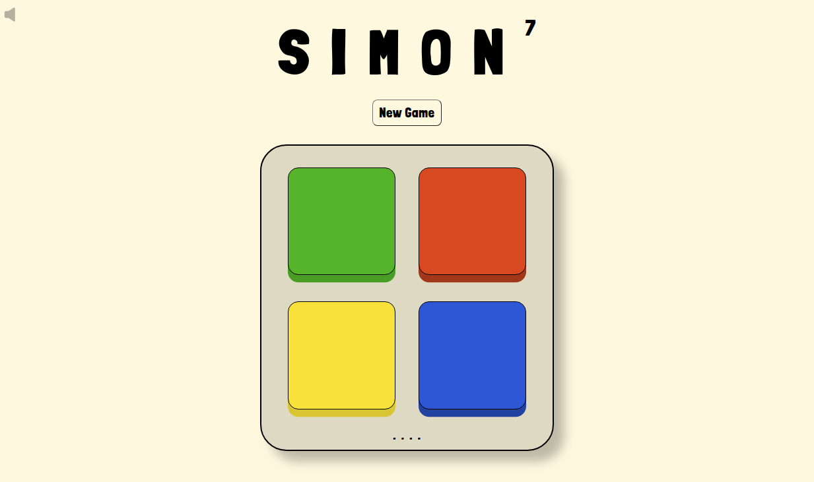

# SEIR-3221 - Project 1
#### **Latham Johnson, April 2020**

## SIMON

### Installation Instructions
1. Download the project by clicking the green **Code** button above and selecting **Download ZIP**
2. Extract the contents of **Project-1.zip** to a folder on your computer
3. Open **index.html** using a web browser 
4. Good luck!
____

## About the Game
SIMON is an in-browser game built with `HTML`, `CSS`, and `JavaScript`. Many variations of Simon exist, all of which require players to repeat a task given to them by "Simon". In this version, the task is to press tiles in order, and Simon is your computer. 

### Playing SIMON
Players can tailor the gameplay to their liking: by toggling tile sounds with the speaker
icon in the top left, and by selecting a game difficulty within the **New Game** button. (Changing the difficulty will change the speed at which tiles are activated in sequence). 

The game starts with a sequence of one tile and prompts the player to repeat it. Each correct response will bring the player one level higher, with a new sequence that is one tile longer. The highest level attained by the player will always remain displayed alongside the title, and the game will only end if the player incorrectly repeats a sequence. 
 
## Planning

Development of SIMON began as the basic wireframe above, including five main elements:
- A title card
- A `div` of four interactable elements, each designated by color
- An `animation` to illustrate when each tile is activated
- A `button` element, allowing players to start a new game
- A dynamic readout, displaying relevant information to the user such as level, correct, incorrect, etc.

### Pain Points
Implementing sound effects presented the largest hurdle in development. When a tile is activated, its sound effect is played by the same `function` that handles its animation. This means that the sound duration is cropped to match the animation time, resulting in choppy and inconsistent sounds at higher difficulties. Instead of removing this functionality completely, I opted to give users the choice by implementing a **mute** button.
